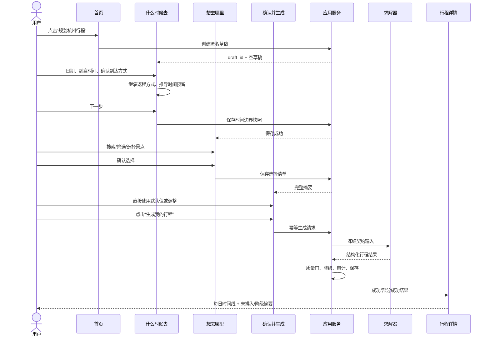
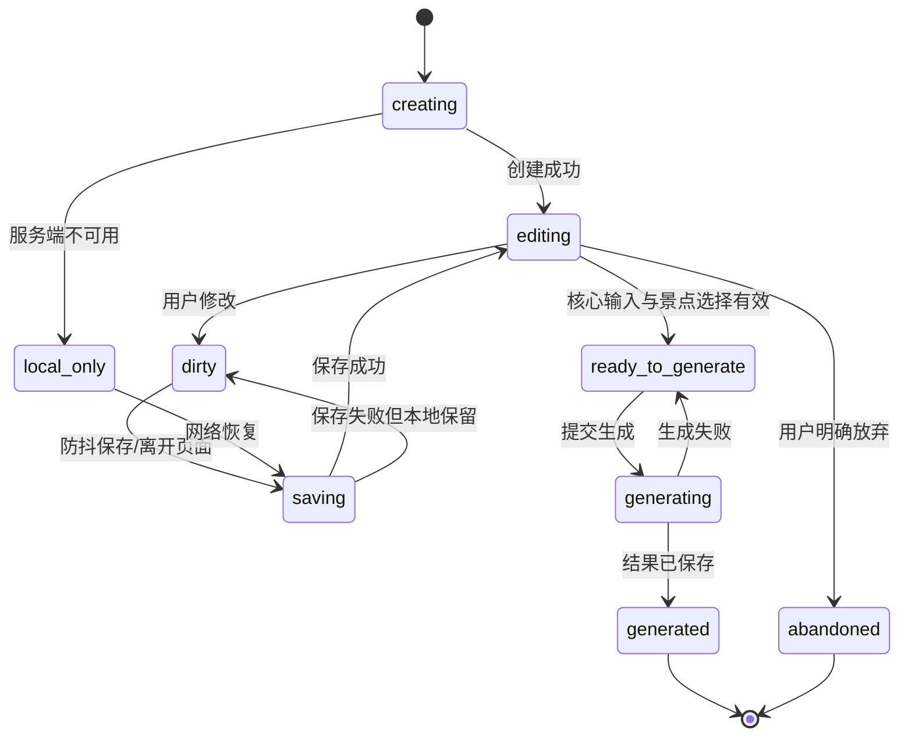
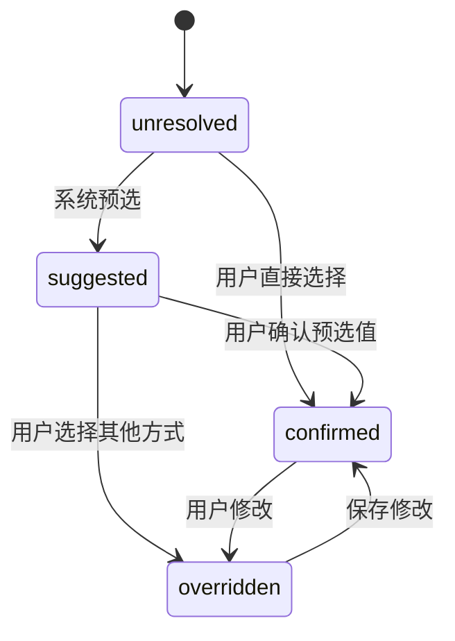
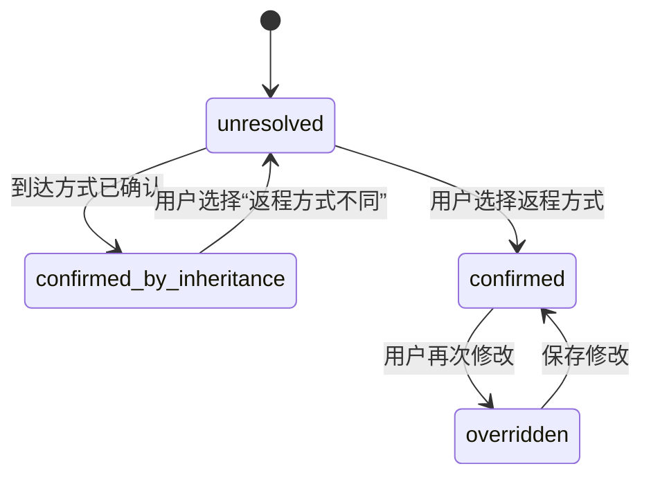
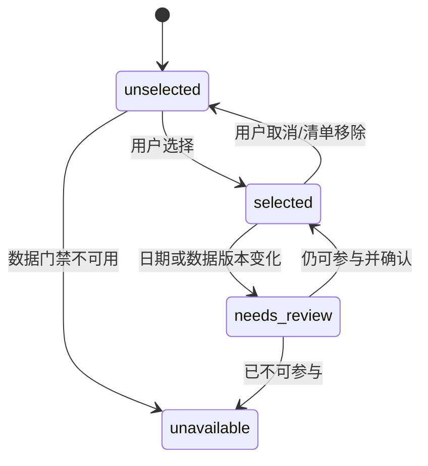
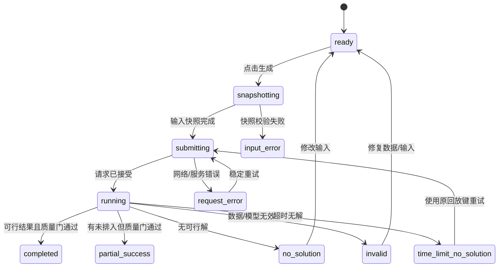
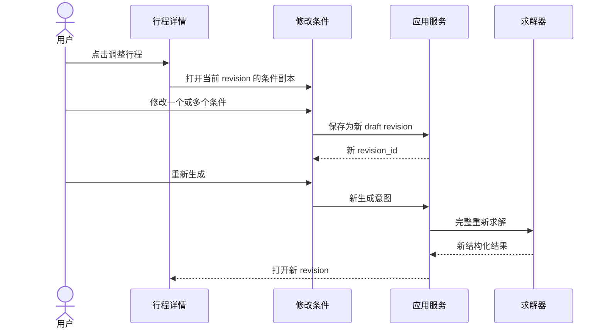
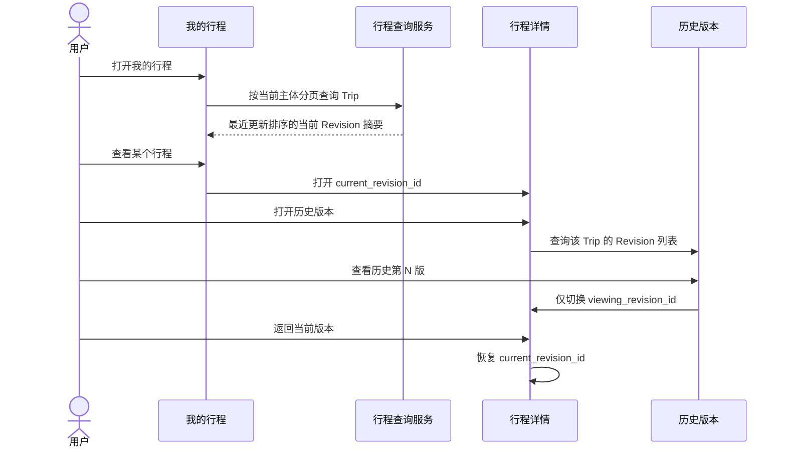
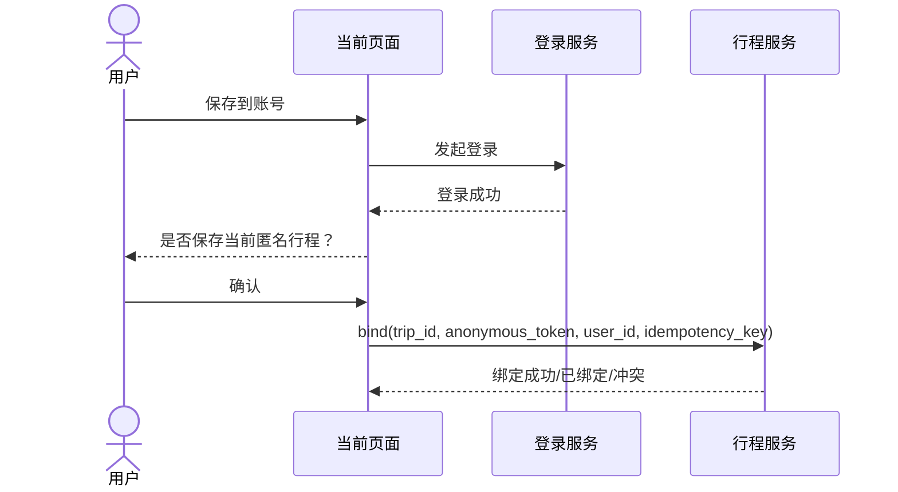

# M1 交互流程与状态机设计

- 文档版本：V1.1
- 日期：2026-08-24
- 产品里程碑：M1
- 设计阶段：A3
- 上游输入：功能模块设计 V3.0（M1 详细范围）、信息架构与 UI 设计 V1.1、ADR-0009、M1 求解器契约
- 目标：将页面设计转成可实现、可测试、可恢复、可审计的交互协议

> 范围说明：IF-01–IF-12 仍只覆盖 M1。M2/M3/M4 后续必须新增行程生命周期、节点到达/完成/跳过、节点/日期小记、媒体上传恢复、内容授权、旅程回顾发布、评分讨论与审核、动态重排以及自动游记流程；这些流程不得被现有 IF-11“计划分享”代替。

## 1. 设计原则

### 1.1 用户动作与系统状态分离

页面跳转不等于业务状态已经提交。例如用户从 P01 进入 P02 时，系统必须先形成可恢复的草稿快照；浏览器地址变化不能代替保存成功。

### 1.2 所有长动作可识别

保存、恢复、生成、绑定和分享均有明确的开始、成功、失败状态。禁止点击后无反馈，也禁止使用无法对应真实进度的百分比。

### 1.3 返回不丢数据

正常返回保留输入；只有用户明确选择“放弃草稿”“移除景点”或“恢复系统默认”时才丢弃对应内容。

### 1.4 重试不改变语义

系统故障重试沿用原输入快照和回放键；用户修改输入后重新生成属于新修订。两者不得共用含义模糊的按钮。

### 1.5 错误尽量就地修复

字段错误在当前页面修复；数据或行程问题从结果页进入对应条件；不让用户为修改一个字段重走全部流程。

## 2. 交互流程编号

| 编号 | 流程 | 优先级 | 首个切片 |
|---|---|---:|---:|
| IF-01 | 首次生成行程 | P0 | 是 |
| IF-02 | 草稿创建、自动保存与恢复 | P0 | 是 |
| IF-03 | 到达交通确认与返程继承 | P0 | 是 |
| IF-04 | 景点搜索、选择与清单维护 | P0 | 是 |
| IF-05 | 生成提交、幂等与结果分流 | P0 | 是 |
| IF-06 | 未排入与软降级处理 | P0 | 是 |
| IF-07 | 高级时间预留调整 | P0 | 是 |
| IF-08 | 行程条件修改与新修订 | P1 | 否 |
| IF-09 | 匿名登录与行程绑定 | P1 | 否 |
| IF-10 | 反馈提交 | P1 | 否 |
| IF-11 | 分享与回流 | P1 | 否 |
| IF-12 | 离线、过期与数据版本变化 | P0/P1 | 部分 |

## 3. IF-01 首次生成行程

### 3.1 主流程



### 3.2 前置条件

- 匿名会话或已登录身份有效；
- 杭州存在可发布的数据版本；
- 页面可创建唯一 `draft_id`；
- 没有未解决的草稿版本冲突。

### 3.3 完成条件

- 生成成功时存在 `trip_id` 和 `revision_id`；
- 输入快照、数据版本、契约版本和结果已保存；
- 景点守恒和硬质量门通过；
- 页面能区分完整成功与部分成功；
- 生成失败时仍保留草稿和选择清单。

### 3.4 返回规则

| 当前页 | 用户返回 | 处理 |
|---|---|---|
| P01 | 返回 P00 | 自动保存；首页显示继续草稿 |
| P02 | 返回 P01 | 保留已选景点；时间条件修改后重新校验选择上下文 |
| P03 | 返回 P02 | 保留节奏、同行人群和高级设置 |
| P04 | 浏览器返回 | 回到 P03 只用于查看原摘要，不自动重新生成 |

## 4. IF-02 草稿状态机



### 4.1 草稿字段状态

| 状态 | UI | 是否允许离开 | 是否允许生成 |
|---|---|---:|---:|
| `creating` | 创建中骨架 | 是，但返回首页 | 否 |
| `editing` | 已保存 | 是 | 取决于字段有效性 |
| `dirty` | 正在自动保存/待保存 | 是，本地先保留 | 允许，但提交前必须形成请求快照 |
| `saving` | 低强调保存状态 | 是 | 生成动作等待快照完成或合并保存 |
| `local_only` | 离线草稿 | 是 | 否，求解需要服务端数据 |
| `ready_to_generate` | 可生成 | 是 | 是 |
| `generating` | 禁止重复提交 | 不建议离开；离开后可恢复状态 | 已在生成 |
| `generated` | 跳转结果 | 是 | 不重复生成 |
| `abandoned` | 不再恢复 | 是 | 否 |

### 4.2 自动保存冲突

M1 单设备匿名场景使用最后写入加草稿版本号。如果服务端返回版本冲突：

1. 不静默覆盖；
2. 比较本地未保存变更与服务端更新时间；
3. 首个切片优先保留本地编辑内容，创建新版本并记录冲突；
4. 登录多设备阶段提供“使用此设备/使用云端版本”的明确选择。

## 5. IF-03 交通确认与继承状态机

### 5.1 到达交通



只有 `confirmed` 或已保存的 `overridden` 允许进入下一步。

### 5.2 离开交通



### 5.3 关键交互规则

- 到达方式预选不能因为用户填写其他字段而自动确认；
- 用户点击 P01 主按钮时，如仍为 `suggested`，聚焦交通方式并提示“请确认”；
- 离开方式继承必须在页面和 P03 摘要中可见；
- 修改到达方式时，如果离开方式仍是继承状态，则同步更新；
- 如果离开方式已经由用户单独确认，修改到达方式不能覆盖它；
- 选择“已在目的地”后，到达时间语义改为可开始游玩时间，清除不适用的进城接驳值；
- 从“已在目的地”切回车站/机场方式时，重新推导接驳时间。

## 6. IF-04 景点选择状态机



### 6.1 搜索和筛选

- 搜索、筛选只改变可见集合，不改变选择集合；
- 清空搜索恢复当前筛选结果；
- 切换筛选时已选数量保持；
- 返回 P01 修改日期后，P02 对已选项重新计算日期化开放摘要；
- 数据本身未验证/冲突时是 `unavailable`；旅行某日闭馆不直接把景点变为数据不可用，最终由求解器判断可用日期。

### 6.2 确认选择

- 0 个景点：阻断并提示至少选择一个；
- 景点较多：显示非阻断提示，允许继续；
- 所有选择以 attraction ID 保存；
- 提交 P03 前执行轻量存在性和数据状态检查，不在前端模拟完整求解。

## 7. IF-05 生成请求、幂等与结果分流

### 7.1 生成状态机



### 7.2 幂等规则

点击生成时客户端创建 `generation_intent_id`，服务端结合草稿修订生成幂等键。以下情况必须返回同一任务或结果：

- 用户双击；
- 网络超时后客户端重发；
- 页面刷新后恢复；
- 同一草稿修订、同一生成意图重复到达。

用户修改任一参与求解字段后，必须产生新草稿修订和新生成意图。

### 7.3 按钮行为

| 状态 | 主按钮 | 行为 |
|---|---|---|
| ready | 生成我的行程 | 创建快照并提交 |
| snapshotting/submitting/running | 正在生成 | 禁用重复操作，保留摘要 |
| request_error | 重试生成 | 沿用原输入快照和意图 ID |
| input_error | 修改信息 | 跳到第一个错误字段 |
| completed/partial_success | 查看行程 | 跳转 P04 |

### 7.4 结果分流

| 应用结果 | 页面结果 | 用户文案 |
|---|---|---|
| 质量门通过、无未排入 | P04 正常 | 行程已生成 |
| 质量门通过、有未排入 | P04 `partial_success` | 行程已生成，有 N 个景点未排入 |
| 软降级 | P04 `soft_degraded` 附加状态 | 行程可用，部分体验使用了替代安排 |
| `no_solution` | P03 阻断错误 | 当前条件下无法形成可行行程 |
| `time_limit_no_solution` | P03 阻断错误 | 本次未能在时限内找到可行安排 |
| `invalid` | P03 数据/系统错误 | 当前数据或输入无法用于生成 |
| HTTP/网络失败 | P03 请求错误 | 未完成生成，草稿已保留 |

## 8. IF-06 未排入与软降级处理

### 8.1 分区原则

```text
未排入 = 景点没有进入时间线，需要用户知道和可能处理
软降级 = 行程仍然可用，只是体验未达到优选状态
```

### 8.2 未排入处理路由

| 原因类别 | 首选动作 | 次选动作 |
|---|---|---|
| 闭馆/无匹配开放规则 | 更换旅行日期条件 | 移除景点 |
| 极端天气室外不可用 | 保留等待天气变化/替换室内景点 | 移除 |
| 与到达/离开锚点冲突 | 调整时间边界 | 移除 |
| OD 缺失 | 稍后重试/报告数据问题 | 移除 |
| 当日容量不足 | 调整节奏或减少景点 | 修改旅行天数 |
| 搜索时限无解 | 稳定重试 | 调整条件 |

M1 首个切片没有自动推荐替代景点，因此不能显示“为你换一个”假入口；可提供“返回景点列表”。

### 8.3 软降级交互

- 晚餐 60 分钟：说明已缩短但仍保留；
- 晚餐未安排：提示用户自行安排用餐时间，不阻断行程；
- 时段 fallback：显示实际安排和偏好未命中；
- 近似 OD：说明部分交通为估算；
- `best_so_far`：说明已找到可行结果，但搜索未完整结束；
- 软降级默认汇总，用户展开后看逐项细节。

## 9. IF-07 高级时间预留调整

### 9.1 打开与保存

1. 用户从 P01 或 P03 点击“调整/高级设置”；
2. D01 以当前有效值打开；
3. 修改只在面板内部形成临时值；
4. 点击保存后进行范围和跨字段校验；
5. 校验通过更新草稿并关闭；
6. 点击遮罩、返回或取消时不应用未保存值。

### 9.2 恢复系统建议

“恢复系统建议”只重置 D01 三个时间值，不影响日期、交通方式和景点选择。恢复后显示建议来源和精度；用户仍需点击保存。

### 9.3 推导失败

如果系统缺少某一项建议：

- 只将该项标记为需要确认；
- 其他两项继续使用已知值；
- 提供业务化建议值和原因；
- 禁止默认 0；
- 用户确认后记录来源为 `user_confirmed_fallback`。

## 10. IF-08 行程修改与新修订



### 10.1 规则

- 原修订不覆盖；
- 修改单项时其他输入完整保留；
- 删除/替换景点必须完整重新求解；
- “系统重试”不创建用户可见新修订；
- “修改后重新生成”创建新修订；
- “换一个方案”不在 M1，不能借重新生成实现随机漂移。

### 10.1.1 A6-9.1 已实现口径

- P04 景点卡直接提供“替换景点”，用户不需要重新走日期、交通和全量景点选择流程；
- 候选页排除当前已选景点，用户选择一个候选并确认一次后提交完整重求解；
- 修订 Intent 显式记录 `target_trip_id` 与 `base_revision_id`；提交完成时以基准 Revision 为条件原子更新 Trip 当前版本；
- 成功后在同一 Trip 下创建 `revision_number + 1` 并切换页面，失败或版本冲突时继续展示旧 Revision；
- 当前仅完成“单景点替换”，删除、加入、时段偏好和全局条件修改仍按 IF-08 后续实现。

### 10.1.2 A6-9.2 行程历史与只读回看



规则：

- 服务端按主体过滤后再排序、分页，匿名用户不能看到其他设备会话的 Trip；
- `current_revision_id` 是服务端事实，`viewing_revision_id` 是客户端临时查看状态，两者不得混用；
- 打开行程默认查看当前 Revision；查看历史和浏览器刷新都不得触发重新求解；
- 历史详情必须显示只读提示并隐藏“替换景点”等写入口；
- 返回当前版本只切换查看指针，不创建 Intent、Draft 或 Revision；
- 草稿和生成失败状态尚未进入 A6-9.2 首版列表，后续加入时使用独立恢复/重试流程。

### 10.2 放弃修改

P05 有未保存修改时返回，提示：

```text
放弃这次修改？
原行程不会改变。
[继续修改] [放弃修改]
```

无修改时直接返回 P04，不弹确认。

## 11. IF-09 匿名登录与绑定

### 11.1 触发时机

登录只在以下动作触发：

- 保存到账号；
- 跨设备查看；
- 查看账号历史；
- 分享需要账号归属的能力。

首次生成不强制登录。

### 11.2 绑定流程



### 11.3 失败规则

- 登录取消：返回原页面，匿名行程仍可访问；
- 登录失败：不清除草稿和匿名令牌；
- 重复绑定：幂等返回已绑定；
- 行程已属于其他账号：禁止越权并保留本地访问提示；
- 绑定成功后匿名 token 可以在迁移期继续只读，具体失效策略在 A5 定义。

## 12. IF-10 反馈提交

- 反馈关联具体 `trip_id + revision_id`；
- 先选择整体判断，再选择原因，文字可选；
- 提交按钮防重复；
- 网络失败保留未提交内容并允许重试；
- 重复反馈采用更新还是新增由 A5 契约明确，M1 推荐同用户/匿名身份对同修订幂等更新；
- 反馈成功不自动跳离结果页。

## 13. IF-11 分享与回流

### 13.1 分享方

P04 → P08 分享预览 → 生成分享对象 → 调用平台分享。生成失败不影响原行程。

### 13.2 访问方

分享链接只携带受限 `share_token`：

```text
打开分享
→ 查看只读摘要
→ 查看数据日期与来源提示
→ 选择“以此为参考新建行程”
→ 创建自己的草稿副本
```

不能用分享 token 修改原行程，也不能暴露匿名访问 token、精确票号或私人备注。

## 14. IF-12 离线、过期与版本变化

### 14.1 离线

| 场景 | 处理 |
|---|---|
| P01/P02 正在编辑 | 本地保存，显示离线状态 |
| 进入 P03 | 可查看摘要，但生成按钮禁用并说明需联网 |
| 生成请求发送后断网 | 使用意图 ID 查询/重试，不新建任务 |
| P04 已缓存 | 可只读查看，标明可能不是最新状态 |

### 14.2 匿名访问过期

- 本地仍有草稿：允许创建新的服务端草稿并迁移输入；
- 只有过期 trip ID、无本地数据：提示重新规划或登录查找；
- 不自动创建一个内容不完整的新行程。

### 14.3 数据版本变化

草稿创建后、生成前若景点数据版本更新：

1. 应用服务按当前发布版本重新门禁；
2. 如果所有选择仍有效，使用新版本并在快照记录；
3. 如果某些景点停用/冲突，返回 `needs_review`；
4. P02 展示受影响项，用户确认移除或返回修改；
5. 不能静默删除后继续生成。

已生成行程始终引用原数据快照；查看历史行程不自动重算。

## 15. 页面状态与应用状态映射

| 页面状态 | 应用/网络状态 | 允许动作 |
|---|---|---|
| `restoring` | draft loading | 等待、返回首页 |
| `dirty` | local changes | 继续编辑、触发保存 |
| `saving` | draft save pending | 继续编辑；生成前等待一致快照 |
| `validation_error` | input rejected | 修改字段 |
| `submitting` | snapshot/submission/running | 查看摘要，不重复提交 |
| `partial_success` | quality passed + unplaced | 查看行程、处理未排入 |
| `soft_degraded` | quality passed + degradations | 查看行程、展开说明 |
| `blocking_error` | no_solution/invalid/time_limit_no_solution | 重试或修改条件 |
| `offline` | network unavailable | 本地编辑、等待联网 |
| `expired` | token/session expired | 登录、迁移草稿或重新规划 |

## 16. 确认对话框规范

只在会丢失用户显式输入或改变数据归属时确认：

| 操作 | 是否确认 | 文案重点 |
|---|---:|---|
| 返回上一步 | 否 | 自动保存 |
| 取消未保存的高级设置 | 仅有修改时 | 不保存本次调整 |
| 放弃整个草稿 | 是 | 已填内容将不再恢复 |
| 从清单移除单个景点 | 否 | 可立即重新选择 |
| P05 放弃修订 | 有修改时是 | 原行程不受影响 |
| 绑定匿名行程到账号 | 是 | 数据归属改变 |
| 提交生成 | 否 | 幂等且不丢数据 |
| 稳定重试 | 否 | 沿用原输入 |

禁止为普通前进、保存、选择和查看详情堆叠确认弹窗。

## 17. 交互文案词汇

| 不使用 | 使用 |
|---|---|
| regenerate | 修改后重新生成 / 重试生成 / 换一个方案（未来） |
| invalid model | 当前数据无法用于生成 |
| no solution | 当前条件下无法形成可行行程 |
| fallback | 未命中优选时段，已使用可行安排 |
| approximate OD | 部分交通为近似耗时 |
| constraint violation | 时间、开放、天气或交通条件冲突 |
| seed | 不向用户展示 |

## 18. A3 验收场景

### 18.1 正常路径

```gherkin
Given 用户没有登录且没有草稿
When 用户确认到达交通、选择日期和 7 个景点并生成
Then 系统只创建一个生成意图
And 返回质量门通过的行程
And 刷新后可恢复同一结果
```

### 18.2 交通继承

```gherkin
Given 用户已确认到达方式为高铁
When 用户没有选择“返程方式不同”
Then 离开方式为高铁
And 状态为 confirmed_by_inheritance
And 用户只完成一次交通方式选择
```

### 18.3 重复点击

```gherkin
Given 草稿修订未变化
When 用户连续点击生成或网络重发同一请求
Then 服务端只执行或复用一个生成意图
And 用户得到同一任务或结果
```

### 18.4 部分成功

```gherkin
Given 质量门通过且有两个景点未排入
When 用户打开结果页
Then 先展示可执行每日行程
And 显示“2 个景点未排入”摘要
And 未排入与软降级分区展示
```

### 18.5 数据版本变化

```gherkin
Given 用户已选择一个后来被停用的景点
When 用户提交生成
Then 系统不静默删除该景点
And 返回 needs_review
And 用户可看到受影响景点和处理动作
```

## 19. A3.1 跨里程碑流程登记

IF-01–IF-12 仍是 M1 可实现流程。以下流程来自功能模块 V3.0，本轮明确边界、状态和依赖，进入对应里程碑后再补完整时序、错误码和 Given/When/Then 验收集。

| 编号 | 流程 | 里程碑 | 当前同步深度 | 关键依赖 |
|---|---|---:|---|---|
| IF-13 | 开始、继续、暂停和结束行程 | M2 | 核心状态机 | TripExecution、业务时区、幂等 |
| IF-14 | 节点到达、完成、跳过与纠正 | M2 | 核心状态机 | Visit、状态历史、权限 |
| IF-15 | 节点/日期旅行小记 | M2 | 核心状态机 | TravelNote、草稿恢复 |
| IF-16 | 媒体上传、压缩、失败恢复与删除 | M2 | 流程边界 | NoteMedia、对象存储、弱网策略 |
| IF-17 | 小记隐私和内容复用授权 | M2/M3/M4 | 授权模型 | ContentGrant、可见范围、撤回 |
| IF-18 | 创建、编辑和发布旅程回顾 | M2 | 流程边界 | TripRetrospective、实际节点状态 |
| IF-19 | 景点评分 | M3 | 流程登记 | Visit 上下文、评分聚合 |
| IF-20 | 景点讨论发布、点赞和排序 | M3 | 流程登记 | DiscussionPost、Reaction |
| IF-21 | 举报、审核、隐藏、申诉和恢复 | M3 | 治理状态登记 | ModerationCase、管理员权限 |
| IF-22 | 行中异常感知和 Plan B | M3 | 流程边界 | 实时 Provider、动态重排契约 |
| IF-23 | 实际行程回放 | M3 | 流程登记 | Visit、时间、授权照片 |
| IF-24 | 自动游记生成、编辑和发布 | M4 | 流程登记 | 授权素材、AI 生成标识、内容版本 |

## 20. IF-13/IF-14 行程执行状态

### 20.1 行程生命周期

```text
planned
  ├── start(execution_intent_id) ───────────────→ in_progress
  │                                               ├── pause → paused
  │                                               │            └── resume → in_progress
  │                                               ├── complete → completed
  │                                               └── end_early → ended_early
  └── remain planned（仅查看日期到来不能自动启动）
```

规则：

- 开始行程必须由用户主动触发；到达旅行日期只提示，不自动创建“真实经历”；
- `execution_intent_id` 保证双击和网络重发只创建一个 execution；
- execution 固定引用开始时选定的 trip revision，后续计划调整形成新 revision，通过显式关系登记生效版本；
- `completed/ended_early` 后允许补记、修正 Visit 状态和创建回顾，但不得悄悄恢复为进行中；
- 暂停只停止行中提醒，不改变已经完成的节点；
- 取消旅行不等于删除计划，计划、执行和内容保留策略分开。

### 20.2 节点实际状态

```text
planned
  ├── arrive  → arrived ── complete → completed
  │                     └─ skip     → skipped
  ├── complete directly → completed
  └── skip              → skipped

arrived/completed/skipped
  └── correct(previous_version) → 受控回到合法前态或新状态
```

- Visit 状态不覆盖 ItineraryNode 的计划状态和计划时间；
- 允许用户直接标记完成，系统可以提示是否补记到达时间，但不能强制多次操作；
- 跳过需要保留原节点，可选原因不阻塞提交；
- 纠正采用版本或状态历史，重复事件幂等，不通过删除审计记录实现；
- 计划外到访后续允许创建 unplanned Visit，不能为保存小记伪造原计划节点；
- 动态重排只在用户确认后创建新计划修订，并将未发生 Visit 关联到新节点。

## 21. IF-15/IF-16/IF-17 小记、媒体和授权

### 21.1 小记状态

```text
editing_local
  ├── autosave → draft_saved
  ├── submit   → saving → saved_private
  └── discard  → discarded

saved_private
  ├── edit → editing_local
  ├── select_for_retrospective → 原小记仍为 saved_private + 新增授权/引用
  ├── share_to_discussion      → 原小记仍为 saved_private + 新增公开内容关系
  └── delete → deleted
```

绑定规则：

1. 优先绑定当前 TripExecution 下的 Visit；
2. 没有 Visit 时可绑定 itinerary node，并在开始/恢复 execution 后显式匹配；
3. 交通途中、整日感受或计划外经历可以只绑定 trip day；
4. 不允许为了满足外键而让用户选择并未到访的景点；
5. 行程修订、节点删除或动态重排不能导致已经保存的小记丢失。

### 21.2 媒体失败恢复

单个媒体独立维护：

```text
local_selected → compressing → uploading → uploaded
                    │              │
                    └─ failed      └─ failed
                                      ├── retry
                                      └── remove
```

- 文本保存不等待所有图片成功；失败图片以待重试状态保留；
- 单条小记最多 9 张已选择/上传媒体，重复重试不重复计数；
- 删除已被回顾或讨论引用的媒体时，先说明影响并要求确认；
- 对外发布默认移除敏感 EXIF/精确位置，读取定位元数据需要独立授权；
- 客户端压缩不能覆盖原图资产，服务端保存展示版本和必要的安全元数据。

### 21.3 内容授权状态

内容复用必须记录四元组：

```text
source_content + purpose + scope + grant_status
```

| 字段 | 示例 |
|---|---|
| source_content | note_id / media_id |
| purpose | retrospective / discussion / auto_travelogue |
| scope | 当前回顾、指定景点讨论、指定游记草稿 |
| grant_status | granted / revoked / expired |

授权规则：

- 新小记默认 private；
- “加入回顾”不等于“公开到讨论区”；
- M4 自动游记不能读取未授权私密素材；
- 撤回授权后停止新的内容读取和传播；已经发布的派生内容按其独立撤回规则处理，并向用户说明边界；
- 页面必须在发布前集中预览所有将公开的文字、照片和位置相关信息。

## 22. IF-18 与分享语义分流

### 22.1 旅程回顾流程

```text
行程 completed / ended_early
→ 创建私密回顾草稿
→ 展示实际完成/跳过/计划外节点
→ 用户选择要纳入的节点、小记和照片
→ 编辑标题、封面、顺序和说明
→ 隐私脱敏与公开预览
→ 选择可见范围
→ 发布
→ 可撤回/停止链接访问
```

系统可以建议素材，但不能自动勾选私密小记并直接发布。跳过节点默认不作为“去过的地方”展示；如果用户为跳过节点写了说明，可由用户决定是否作为旅程变化内容加入回顾。

### 22.2 三类分享不得复用幂等语义

| 类型 | 触发动作 | 幂等标识 | 内容依据 |
|---|---|---|---|
| 计划分享 | 生成/更新计划卡片 | plan_share_intent_id | trip revision |
| 旅程回顾发布 | 发布实际旅程内容 | retrospective_publish_intent_id | retrospective version |
| 自动游记发布 | 发布用户确认的生成稿 | travelogue_publish_intent_id | travelogue version |

三者可以共用底层图片渲染或链接服务，但不能共用业务实体、标题文案、隐私默认值和转化埋点。

## 23. 跨里程碑交互同步状态

| 范围 | 状态 | 说明 |
|---|---|---|
| IF-01–IF-12 M1 完整流程 | 已完成 | 可进入 A4/A5/A6 |
| IF-13–IF-18 核心边界和状态 | 已同步 | 进入 M2 前补完整异常、时序和验收场景 |
| IF-19–IF-23 M3 流程 | 已登记 | 讨论区上线前必须完成治理流程，Plan B 依赖新契约 |
| IF-24 M4 自动游记 | 已登记 | 依赖内容授权、生成标识和版本模型 |

## 23.1 IF-25 添加餐厅并重排

```text
P04 点击“添加午餐地点/添加晚餐地点”
→ D15 加载餐厅候选
→ 用户选择餐厅（可选展开口味、距离、排队筛选）
→ 创建新草稿并引用当前 Revision 作为 base_revision_id
→ 将餐厅写入新输入快照，保留固定场次和用户锁定项
→ 加载餐厅营业时间、建议用餐时长和高德真实有向 OD
→ 创建新的 generation intent
→ 完整重跑 C1/C2/C4/C5/C6、用餐块和 DAY_SPREAD
→ 成功：生成新 TripRevision，展示变化摘要并切换
→ 失败：保留旧 Revision，展示冲突和“换餐厅/调整时间/取消添加”
```

交互不允许：直接在旧时间线插入餐厅卡、只重算餐厅相邻两条边、覆盖旧 Revision、失败后留下半完成节点。

## 23.2 日内长空档交互

- 系统自动精修不增加用户必填项；
- 默认节奏允许扩展停留至建议时长，并把多个日间景点展开到下午；
- 用户显式选择“希望留出自由活动”后，该空档标记为用户意图，不再作为待优化问题；
- 因开放时间、交通或固定场次无法展开时，页面说明原因，不要求用户理解求解权重；
- 相同输入、数据和版本重复求解仍得到相同结果。

## 24. A3 退出条件

- [x] 首次生成有端到端时序；
- [x] 草稿、交通、景点选择和生成有状态机；
- [x] 返回、自动保存和恢复规则明确；
- [x] 请求幂等、双击和网络重试语义明确；
- [x] 完整成功、部分成功、软降级和失败有独立分流；
- [x] 未排入原因有可执行处理路由；
- [x] 高级设置的保存、取消和恢复默认明确；
- [x] 修订、稳定重试和未来换方案边界明确；
- [x] 匿名登录绑定、反馈和分享流程明确；
- [x] 离线、过期和数据版本变化有恢复策略；
- [x] A4 可以据此定义应用用例和前后端状态；
- [x] A5 可以据此定义幂等键、版本字段、错误码和 API。
- [x] IF-13–IF-24 已建立跨里程碑流程编号和依赖；
- [x] 计划行程、实际执行和内容记录状态已经分离；
- [x] 节点小记采用 Visit/节点优先、日期回退；
- [x] 媒体失败不阻塞文字保存，弱网恢复边界明确；
- [x] 内容授权不通过修改原始小记可见性偷换语义；
- [x] 计划分享、旅程回顾和自动游记使用不同发布意图；
- [x] 同步未扩大 M1 首个纵向切片。
