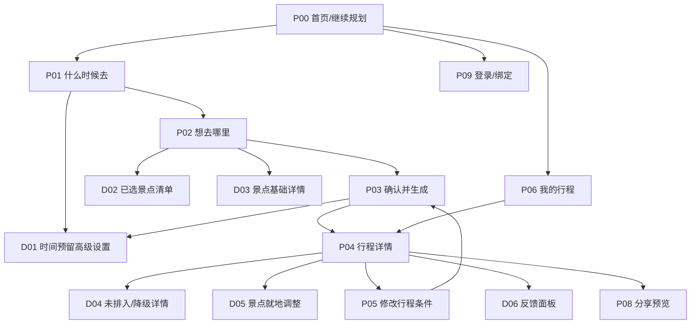

# M1 用户端与 OM1 管理端信息架构/UI 设计

- 文档版本：V1.4
- 日期：2026-08-29
- 产品里程碑：M1
- 管理侧里程碑：OM1（设计完成，实现未开始）
- 设计阶段：A2
- 上游输入：功能模块设计 V3.5（M1 详细范围）、管理端功能模块设计 V1.0、ADR-0009、ADR-0018、ADR-0019、M1 求解器契约
- 设计目标：用户端以最少操作完成首次生成；管理端以桌面工作台完成可追溯审核和发布，两者入口、身份和导航严格分离

## 1. 设计范围

本文定义：

- M1 前台信息架构；
- OM1 管理端信息架构、页面目录和响应式边界；
- 页面编号、路由和页面职责；
- 三步首次生成流程；
- 导航、返回、草稿恢复和修订入口；
- 页面正常、加载、空、错误、部分成功和降级状态；
- 关键页面低保真结构；
- H5 与微信小程序的响应式和平台差异；
- 页面与功能点的映射；
- A3 交互流程和 A4/A5 工程设计的输入边界。

本文不决定视觉品牌稿、插画、最终图标、接口字段名或数据库表结构。

> 范围说明：本文件仍是 M1 信息架构，不因功能模块 V3.0 补齐 M2–M4 而扩大首个切片。后续里程碑必须新增页面族：行程执行、节点小记/媒体、旅程回顾、景点评分与讨论、内容治理、自动游记及旅行档案。计划分享页不得直接复用为旅程回顾页。

## 2. UI 设计原则

### 2.1 默认路径优先

用户第一次生成行程只经过：

```text
P01 什么时候去
→ P02 想去哪里
→ P03 确认并生成
→ P04 行程详情
```

高级设置、数据来源、拒绝码详情和修订历史不进入默认路径。

### 2.2 渐进式披露

| 信息等级 | 默认表现 | 示例 |
|---|---|---|
| 必须立即决策 | 主区域直接展示 | 日期、到离时间、到达交通方式 |
| 可接受默认值 | 展示默认值，允许一键修改 | 适中节奏、返程沿用到达方式 |
| 系统推导结果 | 摘要展示，细节折叠 | 进城接驳、提前到站、末景返程 |
| 专业/低频调整 | 抽屉或折叠面板 | 逐景点时段偏好 |
| 技术证据 | 二级详情 | 数据版本、近似 OD、搜索状态 |
| 系统控制面 | 不展示 | seed、成本权重、硬约束开关 |

### 2.3 一页一个主要任务

- P01 只解决旅行边界；
- P02 只解决景点选择；
- P03 只解决确认与生成；
- P04 只解决查看、理解和进入调整；
- 每个页面只能有一个高强调主按钮。

### 2.4 先展示结果，再展示解释

结果页先让用户看到“今天去哪、几点到、怎么走”，再通过标签和展开区说明天气、时段偏好、交通精度和求解状态。不能用大段技术说明压过行程本身。

### 2.5 硬失败、未排入与软降级视觉分级

| 级别 | 视觉语义 | 行为 |
|---|---|---|
| 阻断错误 | 明确错误区和修复按钮 | 不能继续生成 |
| 部分未排入 | 警示摘要，但保留成功行程 | 查看原因、删除、换日期或替换 |
| 软降级 | 中性提示 | 查看说明，可继续使用 |
| 普通建议 | 低强调辅助信息 | 无需处理 |

不依赖颜色单独表达状态，必须同时使用文字、图标和层级。

## 3. 信息架构

### 3.1 前台页面地图



`Dxx` 表示抽屉、底部面板或对话框，不占据一级导航位置。

### 3.2 一级导航

首个匿名纵向切片不设置底部多 Tab 导航，避免只有少量页面时制造空入口：

```text
首页 → 创建/继续规划 → 结果
```

M1 登录和历史行程完成后，移动端可以使用两个一级入口：

```text
规划行程
我的行程
```

“我的”“社区”“发现”“消息”均不在 M1 设置一级导航。

### 3.3 页面层级

| 层级 | 页面 | 说明 |
|---|---|---|
| 一级入口 | P00、P06 | 新建/继续和历史行程 |
| 核心任务 | P01、P02、P03、P04 | 首次生成闭环 |
| 修改任务 | P05 | 修改全局条件并形成新修订 |
| 辅助任务 | P08、P09 | 分享、登录与匿名绑定 |
| 上下文面板 | D01–D06 | 不打断当前页面上下文的低频操作 |

## 4. 页面目录与优先级

| ID | 页面/面板 | 路由建议 | 里程碑 | 优先级 | 首个切片 | 主要功能点 |
|---|---|---|---|---|---|---|
| P00 | 首页/继续规划 | `/` | M1 | P0 | 是 | 1.1.1、1.1.3、6.1.1 |
| P01 | 什么时候去 | `/trips/new/time` | M1 | P0 | 是 | 1.2.*、1.3.*、1.5.1–1.5.2 |
| P02 | 想去哪里 | `/trips/new/attractions` | M1 | P0 | 是 | 2.1–2.4 |
| P03 | 确认并生成 | `/trips/new/review` | M1 | P0 | 是 | 1.5.3–1.5.5、3.1.* |
| P04 | 行程详情 | `/trips/:tripId` | M1 | P0 | 是 | 4.1–4.7、5.1.3 |
| P05 | 修改行程条件 | `/trips/:tripId/edit` | M1 | P1 | 否 | 5.2.*、5.3.1 |
| P06 | 我的行程 | `/trips` | M1 | P1 | 否 | 5.4.*、6.2.* |
| P08 | 分享预览/公开访问 | `/pages/plan-share-create/index`；`/pages/plan-share-view/index?token=...` | M1 | P1 | 否（公开读取无需登录；参考复制需访客会话） | 6.4.* |
| P09 | 登录/绑定 | `/auth` | M1 | P1 | 否 | 6.2.* |
| D01 | 时间预留高级设置 | 当前页面板 | M1 | P0 | 是 | 1.3.3、1.3.6–1.3.8、1.5.4 |
| D02 | 已选景点清单 | P02 面板 | M1 | P0 | 是 | 2.4.2–2.4.6 |
| D03 | 景点基础详情 | P02 面板 | M1 | P0 | 是 | 2.3.* |
| D04 | 未排入/降级详情 | P04 面板 | M1 | P0 | 是 | 4.7.* |
| D05 | 景点就地调整 | P04 面板 | M1 | P1 | 否 | 5.2.2–5.2.4 |
| D06 | 反馈面板 | P04 面板 | M1 | P1 | 否 | 6.3.* |

没有 P07 是有意保留编号，供未来异步生成独立状态页使用；首个同步版本在 P03 内展示生成状态。

## 5. 页面状态体系

所有页面使用统一状态词汇，避免各页面自行发明加载和错误语义。

| 状态 | 含义 | UI 要求 |
|---|---|---|
| `initial` | 首次进入且无数据 | 显示最小引导和主任务 |
| `restoring` | 恢复本地/服务端草稿 | 骨架屏；禁止覆盖现有本地输入 |
| `ready` | 数据可交互 | 主按钮按校验状态启用 |
| `dirty` | 用户修改未持久化 | 自动保存状态可见但低强调 |
| `saving` | 正在保存 | 不阻塞继续填写；离开前处理冲突 |
| `validation_error` | 用户输入错误 | 字段就地错误 + 页面首个错误聚焦 |
| `loading` | 加载列表或详情 | 保留页面结构，避免内容跳动 |
| `empty` | 合法但无内容 | 解释原因并提供下一步 |
| `submitting` | 正在生成 | 禁止重复提交；可见当前动作 |
| `partial_success` | 有行程且存在未排入 | 先展示可用行程，再展示未排入摘要 |
| `soft_degraded` | 有软降级 | 中性提示，不抢占主任务 |
| `blocking_error` | 无法继续 | 原因、影响和唯一首选修复动作 |
| `offline` | 网络不可用 | 保留本地草稿；需要联网的动作禁用 |
| `expired` | 匿名访问或数据过期 | 登录/重新生成/返回首页三者择一主次 |

## 6. 页面详细设计

### 6.1 P00 首页/继续规划

#### 页面目标

让新用户立即开始，让有草稿或历史行程的用户用一次操作继续。

#### 信息层级

1. 产品一句话价值：避开闭馆、赶路和时间冲突，快速生成可靠行程；
2. 主按钮“规划杭州行程”；
3. 若存在未完成草稿，显示“继续上次规划”；
4. 若已登录且有历史，显示最近一条行程入口；
5. 不在首屏展示功能大全、社区、推荐榜或长篇 AI 介绍。

#### 低保真结构

```text
┌──────────────────────────────┐
│ 旅行助手              我的行程│
│                              │
│ 把想去的地方，排成真正走得通的行程 │
│ 自动考虑闭馆、时间、天气与交通      │
│                              │
│ [ 规划杭州行程 ]              │
│                              │
│ ┌─ 继续上次规划 ────────────┐ │
│ │ 杭州 · 9/1–9/3 · 已选 7 个 │ │
│ │                     [继续] │ │
│ └──────────────────────────┘ │
└──────────────────────────────┘
```

草稿卡只在确实存在时显示，不使用空卡填充页面。

### 6.2 P01 什么时候去

#### 页面目标

用最少输入建立可靠的旅行日期和 C4 时间边界。

#### 默认内容

- 杭州作为已确认目的地；
- 日期范围；
- 首日到达时间；
- 到达交通方式快捷选择；
- 末日离开时间；
- 返程方式默认继承；
- 时间预留摘要；
- 主按钮“选择想去的景点”。

#### 低保真结构

```text
┌──────────────────────────────┐
│ ‹ 返回       1/3 什么时候去    │
│ ━━━━━━━░░░░░░░░░░░░░░░░░░   │
│                              │
│ 目的地                        │
│ 杭州 · 当前开放城市            │
│                              │
│ 旅行日期                      │
│ [9月1日]  至  [9月3日]         │
│ 3 天                          │
│                              │
│ 第一天几点到杭州？              │
│ [14:00]                       │
│                              │
│ 怎么到杭州？                   │
│ [高铁/动车] [飞机] [自驾] [其他]│
│                              │
│ 最后一天几点离开？              │
│ [16:00]                       │
│                              │
│ 返程方式                      │
│ 与到达方式相同：高铁/动车 [更改] │
│                              │
│ 已预留进城与返程时间             │
│ 进城45分 · 提前到站60分          │
│ 末景返程45分             [调整] │
│                              │
│ [ 选择想去的景点 ]              │
└──────────────────────────────┘
```

#### 校验

- 日期错误定位在日期组件；
- 到达交通预选但未确认时，主按钮点击后聚焦交通区域；
- 返程继承在界面中显式展示；
- 选择“已在目的地”后，将“几点到杭州”替换为“第一天几点可以开始游玩”；
- 推导失败只在时间预留摘要中请求确认缺失值。

### 6.3 D01 时间预留高级设置

使用移动端底部抽屉、桌面侧边面板。内容只有三个业务化字段：

```text
进城接驳时间       [45 分钟]
返程提前到站       [60 分钟]
末景到返程节点     [45 分钟]

数值来源：按高铁出行的建议预留
[恢复系统建议]            [保存]
```

不得展示缓冲比例、求解器成本、seed 或硬约束开关。若某值来自近似 OD，直接显示“近似交通耗时”。

### 6.4 P02 想去哪里

#### 页面目标

在不制造推荐幻觉的前提下，让用户快速找到并选择景点。

#### 页面结构

```text
┌──────────────────────────────┐
│ ‹ 返回       2/3 想去哪里      │
│ ━━━━━━━━━━━━━░░░░░░░░░░      │
│ [搜索景点名称              🔍] │
│                              │
│ [全部] [自然山水] [人文] [博物馆]│
│ [室内] [室外] [更多筛选]       │
│                              │
│ □ 西湖                       │
│   自然山水 · 室外 · 体力2星     │
│   建议 180 分钟        [查看]  │
│                              │
│ ☑ 灵隐寺                     │
│   寺庙祈福 · 室内外 · 体力3星   │
│   建议 150 分钟        [查看]  │
│                              │
│ □ 浙江省博物馆                │
│   博物馆 · 室内 · 体力1星       │
│   周一闭馆             [查看]  │
│                              │
│ ┌──────────────────────────┐ │
│ │ 已选 7 个 · 3 天  [查看清单]│ │
│ │         [ 确认选择 ]       │ │
│ └──────────────────────────┘ │
└──────────────────────────────┘
```

#### 选择交互

- 点击复选区域直接选择，不要求先进入详情；
- 点击名称或“查看”进入 D03；
- 已选数量栏在有选择后出现；
- 超量只提示，不强制阻止；
- 搜索和筛选不会清除已选项；
- 不可参与求解的数据禁选并说明，不与旅行日期闭馆混为一类。

### 6.5 D02 已选景点清单

展示所有已选项、总建议时长和非阻断密度提示。支持移除和回到列表继续选择。

```text
已选 7 个景点
预计总游览约 17 小时
3 天通常可以安排，实际结果以开放时间和交通为准

灵隐寺           150 分钟   [移除]
西湖             180 分钟   [移除]
河坊街            90 分钟   [移除]
...

[继续选择]             [确认]
```

### 6.6 D03 景点基础详情

M1 只展示可信基础信息：名称、类型、室内外、体力、建议时长、旅行日期对应的开放摘要、时段建议和数据来源类型。不展示虚构评论、评分或 AI 推荐理由。

### 6.7 P03 确认并生成

#### 页面目标

让用户理解系统将用什么输入和规则生成，并能就近修改。

#### 低保真结构

```text
┌──────────────────────────────┐
│ ‹ 返回       3/3 确认行程      │
│ ━━━━━━━━━━━━━━━━━━━━━━━      │
│                              │
│ 杭州 · 9/1–9/3 · 3天     [改] │
│ 14:00到达 · 16:00离开     [改] │
│ 高铁往返                  [改] │
│                              │
│ 行程节奏                      │
│ [悠闲] [适中·推荐] [紧凑]      │
│                              │
│ 同行人群（可选）                │
│ [独行] [情侣] [朋友] [亲子] [老人]│
│                              │
│ 已选 7 个景点            [查看] │
│                              │
│ 系统将自动考虑                  │
│ ✓ 闭馆和开放时间                │
│ ✓ 到达和返程时间                │
│ ✓ 天气与景点间交通              │
│ ✓ 晚餐与体力节奏                │
│                              │
│ 时间预留与偏好            [高级设置]│
│                              │
│ [ 生成我的行程 ]                │
└──────────────────────────────┘
```

#### 生成状态

首个同步版本在当前页将主按钮替换为：

```text
正在检查开放时间、天气和交通…
```

禁止重复点击，但保留页面摘要。超过体验阈值后显示“仍在生成，请稍候”，不能伪造百分比。只有真正引入可观测异步阶段后才展示分阶段进度。

### 6.8 P04 行程详情

#### 页面目标

优先展示可执行行程，随后解释未排入和软降级，并提供保存、反馈和调整入口。

#### 信息层级

1. 行程摘要；
2. 日期切换；
3. 当日时间线；
4. 未排入摘要；
5. 软降级和可信度说明；
6. 调整、反馈、分享等次要动作。

#### 低保真结构

```text
┌──────────────────────────────┐
│ 杭州 3日行程          ···      │
│ 9/1–9/3 · 适中 · 高铁往返       │
│                              │
│ [第1天] [第2天] [第3天]         │
│                              │
│ 9月1日 · 小雨 · 预报             │
│                              │
│ 15:00  灵隐寺                  │
│         游览 120 分钟           │
│         时段：可接受             │
│    ↓ 交通 35 分钟（含缓冲）      │
│ 17:35  河坊街                  │
│         游览 85 分钟            │
│    ↓ 步行 12 分钟               │
│ 19:15  喷泉灯光秀 · 固定时间     │
│         19:30–20:00             │
│                              │
│ 晚餐留白：60 分钟 · 已缩短 [说明] │
│                              │
│ ⚠ 2 个景点未排入         [查看] │
│                              │
│ [调整行程]       [这个安排合理吗]│
└──────────────────────────────┘
```

#### 关键规则

- 时间线按求解结果排序，前端不得二次重排；
- 固定演出使用文字“固定时间”，不只用颜色；
- 天气明确标注“预报”或“气候参考”；
- 近似 OD 在当日摘要或可信度区标明，不必在每条交通上重复大字警告；
- 未排入项在首屏可见摘要，但不能遮挡成功行程；
- `best_so_far` 使用“已找到可行安排，搜索在时限内提前结束”等用户文案；
- 无偏好时不展示空的时段标签。

### 6.9 D04 未排入与降级详情

面板分两个区域：

```text
未排入的景点
├── 浙江省博物馆
│   9月1日为周一闭馆
│   [移除] [更换日期条件]
└── 某景点
    与离开时间冲突
    [调整返程时间] [移除]

体验提示
├── 第1天晚餐缩短为60分钟
├── 河坊街未命中优选晚间，但安排在可接受下午
└── 部分交通使用近似耗时
```

硬不可行和软降级不得混为同一列表。

### 6.10 P05 修改行程条件

不是重新走三步流程，而是显示当前条件的分组摘要：日期与锚点、节奏、景点选择、时间偏好。用户进入具体分组修改，其他内容保留。保存后产生新修订，再完整求解。

### 6.11 P06 我的行程

P1 页面。匿名用户只显示当前设备会话可访问的行程；登录用户后续显示账号行程。列表按最近更新排序。

A6-9.2 首版信息层级：

```text
页面标题：我的行程
主操作：＋ 规划新行程
行程卡：城市 / 日期范围 / 结果状态
         已安排数 / 未排入数 / 当前版本号
         总版本数 / 最近更新时间
         [查看行程]
空状态：说明完成一次规划后可从此恢复
分页：[加载更多]（仅 has_more=true 时出现）
```

首版只展示已成功形成 TripRevision 的正式 Trip。草稿与失败 GenerationIntent 尚未并入本页，因此不能用正常行程卡伪装；后续加入时必须使用“草稿/生成失败”独立状态和恢复动作。

P06 下的历史版本子页按版本号倒序展示“当前版本/历史只读”、日期范围、已安排数和未排入数。点击历史版本只改变当前查看的 Revision；详情页显示“正在查看历史第 N 版 · 当前版本是第 M 版”和“返回当前版本”，历史卡片不提供替换景点等写操作。

Taro H5 当前实现路由为 `/pages/trip-list/index` 与 `/pages/trip-revisions/index`；产品语义路由仍记为 `/trips` 与 `/trips/{trip_id}/revisions`。

### 6.12 D06 反馈面板

#### D06-A 节点安排反馈（A6-9.4 已实现）

当前 Revision 的每个景点卡片在替换动作之后显示轻量入口，不遮挡时间、交通或替换功能：

```text
这处安排怎么样？
[👍 安排得好] [👎 需要改进]

需要改进时按需展开：
[时间太赶] [路程太远] [时段不合适]
[停留时长不合适] [景点数据有误]
[补充对“西湖湖滨”安排的说明（可选）]
[提交这处反馈]
```

“安排得好”自动映射 `arrangement_good`；“需要改进”的原因首版单选且可不选。提交成功后原控件变为只读成功态，重复目标显示“已经反馈过”，不伪装为更新成功。历史 Revision 不显示节点反馈控件。

#### D06-B 整体反馈（A6-9.4 已实现）

整体反馈放在当前 Revision 的行程依据说明之后，先问整体判断，再按需展开原因：

```text
这个安排对你来说合理吗？
[合理] [一般] [不合理]

哪里需要改进？（可多选）
□ 路线太绕
□ 时间安排不合理
□ 节奏太紧或太松
□ 漏掉想去的景点
□ 景点数据有误
□ 原因解释不清

补充说明（可选）
[提交反馈]
```

选择“合理”时不展开问题类型并清除已选问题；“一般/不合理”才显示多选原因。文字说明最多 500 字，输入区提示不要填写手机号、票号等敏感信息。提交按钮在未选择评价时真实禁用，提交中显示 loading 并防双击；网络失败保留已选内容和文字，使用同一 intent 重试。

反馈成功后明确显示“已记录对第 N 版行程的反馈”，并说明它只用于改进行程安排，不会成为公开景点评分或评论。同主体对同一 Revision/节点只保留首份；去重时显示“已记录，未重复提交”。API 能准确接收历史 Revision 反馈，但首版 UI 为降低误操作，只在当前 Revision 展示 D06。

响应式规则：375px 下选择按钮可换行，原因 pill 保持可点尺寸，Textarea 和提交按钮占满内容宽度且无横向溢出；1280px 下仍位于详情阅读列中，不扩展为独立宽屏仪表盘。状态文案与 `✓` 图形共同表达成功，不只依赖颜色。

### 6.13 P08 分享预览与 P09 登录

两者均为 P1。分享预览在生成成功后进入；登录不能阻塞匿名生成。登录成功后显式询问是否把当前匿名行程保存到账号，不能自动吞并未知数据。

#### P08-A 原作者安全分享预览（A6-9.3 已实现）

入口位于 P04 当前 Revision 详情页，历史 Revision 首版不显示分享按钮，避免把“正在看的历史版本”和“当前要分享的版本”混淆。路由为 `/pages/plan-share-create/index`。

页面顺序：

```text
SHARE THE PLAN 标题
→ 分享边界说明
→ 当前 Revision 固定、不会随以后修改漂移
→ 不公开匿名凭证、到离交通、内部节点和 OD 明细
→ [生成安全分享预览]
→ plan-share-v1 simple 模板卡片
→ [复制分享链接] [查看访客页面]
```

模板卡必须明确标记“出发前计划”，展示城市、日期、天数、已安排数、Revision 编号、每日景点、上午/下午/晚上、固定场次、粗粒度停留时长、天气参考和隐私提示。普通景点继续使用“约 2 小时/约 2.5 小时”等友好表达，只有固定演出显示准确场次。生成失败时保留原行程和本页说明，允许用户重试，不显示半成品分享链接。

#### P08-B 公开访问与参考复制（A6-9.3 已实现）

路由为 `/pages/plan-share-view/index?token=<plan_share_token>`，无需登录读取。访客页顶部必须说明“他人分享的计划版本，不代表已经实际到访”；卡片下方提供独立回流区：

```text
想按这份路线规划自己的行程？
系统只复制景点集合；日期、到达方式、离开方式和节奏仍由访客确认。
[以此为参考新建行程]
```

访客点击后，如没有匿名会话则先创建自己的匿名主体，再由服务端创建 `travel_facts=null` 的新草稿并进入 P01；不能把原用户日期、私人交通或时段偏好写入新草稿。无效或失效链接显示稳定不可枚举的“无法读取/已失效”状态，不暴露资源是否曾存在。

响应式规则：375px 单列卡片和回流区自然滚动，主按钮可达且无横向溢出；1280px 使用居中阅读列，不拉伸为全宽仪表盘。当前实现是 HTML/CSS 模板和安全链接；PNG/JPEG 导出、二维码/小程序码、保存相册、微信原生分享、作者撤回和转化埋点属于 A6-9.3.1，不在首版完成口径内。

## 7. 页面与功能点映射摘要

| 页面 | 核心功能点 | 不应承担 |
|---|---|---|
| P00 | 1.1.1、1.1.3、6.1.1 | 景点推荐、登录强制门槛 |
| P01 | 1.2.*、1.3.*、1.5.1–1.5.2 | 求解、景点选择、算法参数 |
| P02 | 2.1–2.4 | 深度评论、排行榜、行程排程 |
| P03 | 1.4.*、1.5.3–1.5.5、3.1.* | 直接操作 OR-Tools、展示虚假进度 |
| P04 | 4.1–4.7、5.1.3 | 修改结构化排程事实、静默隐藏未排入 |
| P05 | 5.2.*、5.3.1 | 随机换方案、局部拼接行程 |
| P06 | 5.4.*、6.2.* | 社区和推荐流 |
| P08 | 6.4.* | 暴露匿名令牌和私人交通信息；把计划卡误写成实际游记；把 HTML 预览冒充已完成图片导出 |
| P09 | 6.2.* | 阻塞匿名核心流程 |

完整逐功能映射在 A3/A5 中按用户故事和 API 再展开，避免在页面文档重复整份原子功能表。

## 8. 响应式与多端规则

### 8.1 移动端优先

- 设计基准宽度 375px，支持 320px；
- 主内容单列；
- 页面主按钮位于内容末尾或安全区底部动作栏；
- 底部动作栏不得遮挡最后一项内容；
- 抽屉内容超过一屏时允许内部自然滚动，保存动作保持可达；
- 日期、时间使用平台原生或 Taro 兼容选择器。

### 8.2 H5 宽屏

- 最大阅读宽度建议 720–960px；
- P02 可使用左侧筛选、右侧列表，但窄屏自动回单列；
- P04 在桌面可使用左侧日期导航、右侧时间线；
- 不为桌面端增加不同业务流程，只改变布局。

### 8.3 微信小程序

- 使用小程序原生导航和分享能力；
- 登录在用户保存到账号、查看跨设备历史或分享归属时触发；
- 不在首次进入时强制授权；
- 分享卡的回流路径需要保留 trip share token，与匿名访问 token 分离。

## 9. 组件层级

### 9.1 跨页面基础组件

| 组件 | 职责 |
|---|---|
| `StepHeader` | 返回、步骤 1/3–3/3、简洁进度 |
| `FieldGroup` | 标签、说明、控件、就地错误 |
| `SaveIndicator` | 已保存、保存中、离线待同步 |
| `PrimaryAction` | 每页唯一主操作 |
| `InlineNotice` | 普通建议或软降级 |
| `BlockingError` | 阻断原因和首选修复动作 |
| `BottomSheet` | 移动端上下文调整 |
| `SourceDisclosure` | 数据来源、版本和精度的二级说明 |

### 9.2 旅行建档组件

- `DateRangeField`；
- `TimeField`；
- `TransportTypeQuickSelect`；
- `DepartureInheritanceRow`；
- `TimeReserveSummary`；
- `AdvancedTimeSettings`；
- `PaceSelector`；
- `CrowdSelector`。

### 9.3 景点组件

- `AttractionSearch`；
- `AttractionFilters`；
- `AttractionListItem`；
- `AttractionAvailabilityState`；
- `SelectedAttractionsBar`；
- `SelectedAttractionsSheet`。

### 9.4 行程结果组件

- `TripSummaryHeader`；
- `DayTabs`；
- `DayWeatherHeader`；
- `TimelineVisit`；
- `TransitConnector`；
- `DinnerBlock`；
- `VisitPeriodOutcome`；
- `UnplacedSummary`；
- `DegradationSummary`；
- `TrustDisclosure`。

组件只定义展示职责，不能在前端组件内重新计算 C1–C6 或重新排列景点。

## 10. 可访问性和可理解性

- 所有输入有可见标签，不以 placeholder 代替；
- 错误文本与字段程序化关联；
- 键盘和屏幕阅读器能完成 H5 核心流程；
- 点击区域至少满足移动端可用尺寸；
- 选中状态同时使用文字/勾选，不只改变颜色；
- 进度不只靠动画；
- 生成中状态使用 `aria-live` 等价能力，但不频繁播报；
- 时间使用用户本地语言格式，同时服务端保留结构化日期和分钟值；
- “气候参考”“近似交通”“固定时间”“未排入”使用明确文字。

## 11. UI 埋点位置

| 页面/组件 | 核心事件 |
|---|---|
| P00 | start_trip、resume_draft |
| P01 | arrival_transport_confirm、departure_transport_inherit、advanced_time_open、time_step_complete |
| P02 | attraction_search、filter_change、attraction_select、selected_list_open、attraction_step_complete |
| P03 | pace_change、crowd_select、review_edit、generate_submit、generate_result |
| P04 | day_change、unplaced_open、degradation_open、adjust_start、feedback_open、share_start |

埋点不得包含匿名访问令牌、登录凭证或完整自由文本。

## 12. A2.1 全路线信息架构同步

本节同步功能模块 V3.0 对信息架构的影响。它定义后续页面族、入口和模式边界，但不把 M2–M4 纳入 M1 首个纵向切片，也不替代对应里程碑的详细原型设计。

### 12.1 计划、执行和回顾三种模式

同一个行程在不同生命周期下承担不同用户任务。页面可以复用时间线和景点卡片，但必须明确当前模式，不能把三套操作同时堆在一张卡片上。

| 模式 | 进入条件 | 用户核心问题 | 景点卡主要操作 | 分享语义 |
|---|---|---|---|---|
| `planning` 规划模式 | 行程尚未开始，或用户主动查看计划版本 | 准备怎么走，是否需要调整 | 不去、替换、调整时段、修改条件 | M1 计划分享 |
| `in_trip` 行中模式 | 用户已主动开始行程且未结束 | 现在在哪、下一站去哪、要记录什么 | 已到达、完成、跳过、记录这一刻 | 默认不展示公开分享主操作 |
| `review` 回顾模式 | 行程已完成、提前结束或用户进入回顾 | 实际去了哪里，要留下和分享什么 | 补写小记、选择进回顾、评价景点 | M2 旅程回顾分享 |

模式由业务生命周期决定，不以当前日期或页面路由猜测。用户可以在行中查看原计划，但“查看原计划”不能把 execution 状态切回 planning。

### 12.2 全路线前台页面地图

```text
首页 / 我的行程
├── 创建和规划（M1）
│   ├── P01 什么时候去
│   ├── P02 想去哪里
│   ├── P03 确认并生成
│   ├── P04 行程详情 · 规划模式
│   └── P08 计划分享预览
├── 行程执行（M2–M3）
│   ├── P10 行程执行首页 / 当前日
│   ├── P11 当前节点详情
│   ├── D10 节点状态操作面板
│   └── D11 行中异常与 Plan B
├── 旅行小记（M2）
│   ├── D12 快速记录面板
│   ├── P12 小记编辑页
│   ├── P13 行程小记列表
│   └── D13 媒体预览与排序
├── 旅程回顾（M2）
│   ├── P14 创建旅程回顾
│   ├── P15 选择小记与照片
│   ├── P16 回顾编辑与排序
│   ├── P17 发布预览
│   └── P18 已发布回顾落地页
├── 景点信息与社区（M2–M3）
│   ├── P20 景点深度详情
│   ├── P21 景点讨论列表
│   ├── P22 发布讨论
│   ├── D20 讨论详情
│   └── D21 举报面板
└── 长期内容（M4）
    ├── P30 自动游记编辑
    ├── P31 旅行档案
    └── P32 多人协同行程
```

管理端独立于前台导航。OM1 地点数据治理页面和 OM3 内容治理页面统一使用 O 编号，但里程碑、权限和菜单分组不同：

```text
管理端
├── 身份与总览（OM1）
│   ├── O00 管理员登录
│   ├── O01 管理首页/待办
│   └── O16 管理员与角色
├── 地点数据治理（OM1）
│   ├── O02 候选清单与覆盖矩阵
│   ├── O03 地点详情与 Revision
│   ├── O04 地图、几何与访问点
│   ├── O05 开放时间与固定场次
│   ├── O06 来源与字段冲突
│   ├── O07 地点关系与互斥裁决
│   ├── O08 Revision 审核队列
│   └── O09 发布与研究快照
├── 内容治理（OM3）
│   ├── O10 内容审核队列
│   ├── O11 内容详情与处置
│   ├── O12 举报与申诉
│   ├── O13 用户违规记录
│   └── O14 审核规则配置
└── 审计（OM1–OM4）
    └── O15 审计中心
```

### 12.3 新增页面目录与深化时机

| 页面 | 页面职责 | 里程碑 | 当前同步深度 | 进入详细设计的前置条件 |
|---|---|---:|---|---|
| P10 | 展示当前日、当前/下一节点和执行进度 | M2 | 页面骨架 | TripExecution/Visit 状态规则确认 |
| P11 | 查看单个实际访问节点、计划信息和小记入口 | M2 | 页面骨架 | Visit 与 ItineraryNode 关系确认 |
| D10 | 到达、完成、跳过和撤销 | M2 | 操作边界 | 节点状态机和幂等规则确认 |
| D12/P12 | 快速小记和完整编辑 | M2 | 页面骨架 | 媒体、草稿、隐私和失败恢复规则确认 |
| P13 | 按行程、日期、节点浏览小记 | M2 | 页面骨架 | 小记查询和删除生命周期确认 |
| P14–P18 | 选择素材、编辑、预览、发布和访问回顾 | M2 | 页面族边界 | ContentGrant 和公开范围确认 |
| P20 | 深度信息、照片、评分和讨论入口 | M2/M3 | 页面族边界 | 数据来源和社区冷启动策略确认 |
| P21/P22 | 浏览和发布景点讨论 | M3 | 页面族边界 | 审核、举报和反垃圾规则确认 |
| D11 | 显示受阻影响、Plan B 和用户确认 | M3 | 入口预留 | 动态重排契约设计完成 |
| O00/O01/O16 | 管理身份、待办和角色 | OM1 | 页面职责与权限边界 | R0.2-05-01 管理身份/API/审计实现 |
| O02–O08 | 地点候选、事实、地图、时间、来源、关系和审核 | OM1 | P0 页面结构 | R0.2-05-02 地点审核工作台实现 |
| O09/O15 | 发布、快照和审计 | OM1 | P0 页面结构 | R0.2-07 发布门和研究快照实现 |
| O10–O14 | 内容治理后台 | OM3 | 信息架构 | 权限、审核状态和申诉流程确认 |
| P30–P32 | 自动游记、档案和协同 | M4 | 路线占位 | 对应功能独立 PRD 通过 |

### 12.4 入口和导航规则

- M1 首次生成仍只有 P01 → P02 → P03 → P04，不增加行中或内容步骤；
- P04 在 M2 增加“开始行程”，只有用户主动操作才创建 execution；
- 已开始行程从首页/我的行程优先进入 P10，同时保留“查看原计划”；
- D12 从当前或已访问节点卡片一次操作打开，允许约 10 秒完成文字/拍照/保存；
- 日期级小记入口位于当日页，不要求选择虚假景点；
- 行程结束后显示“创建旅程回顾”，但不自动选择私密小记或自动发布；
- P08 只负责计划分享；P17/P18 只负责实际旅程回顾，二者路由、标题和分析事件分开；
- 景点讨论入口可以出现在 P20 和已完成 Visit，但发布前必须展示公开范围；
- 管理端不进入普通用户导航，也不复用前台身份权限；用户端 token 不能自动兑换管理员会话。

### 12.5 OM1 管理端布局与页面规则

管理端以 1280px 以上桌面宽屏为主要审核环境：

```text
顶部：环境/城市/数据版本 + 当前管理员 + 安全退出
左侧：按权限过滤的一级菜单
中部：列表、地图、表单、版本差异或发布报告
右侧：状态、来源、阻断原因、待办和操作历史上下文栏
```

页面规则：

- O02 使用列表与覆盖矩阵双视图，筛选条件写入 URL，返回时不丢失；
- O03 将基础事实、体验属性和 Revision 历史分区，不把所有 58 个字段铺成单页长表；
- O04 地图同时显示几何、代表点、到达点和离开点，使用不同图形/图例，不只靠颜色；
- O05 采用“周规则 + 日期例外 + 指定日期预览”，跨午夜同时显示业务日和次日；
- O06/O07 使用并排证据对比，裁决前不隐藏被否决来源或地点；
- O08 固定展示完整性检查、版本差异、审核理由和通过/驳回操作；
- O09 发布操作先显示影响预览和稳定拒绝码，通过后才允许确认；
- O15 只读，不能在 UI 修改或删除审计事件；
- O16 角色变更需要高风险确认，操作者不能删除自己的最后一个安全管理权限而不留恢复路径。

移动端只保证 O00 登录、O01 待办和 O15 紧急只读可访问；地图编辑、批量审核、发布和角色管理不以 375×812 为主验收尺寸。

## 13. 跨里程碑组件扩展

| 组件族 | 组件 | 核心职责 |
|---|---|---|
| 行程模式 | `TripModeHeader` | 显示规划/行中/回顾语义和适当主操作 |
| 执行状态 | `ExecutionProgress`、`VisitStatusActions` | 展示当前进度并提交到达/完成/跳过，不改写计划节点 |
| 小记 | `QuickNoteComposer`、`NoteEditor`、`NoteCard` | 节点/日期绑定、草稿恢复、私密提示 |
| 媒体 | `MediaPicker`、`MediaUploadItem`、`MediaSorter` | 上传状态、失败重试、排序、封面和删除 |
| 授权 | `ContentGrantSelector`、`VisibilitySelector` | 明确哪些内容用于讨论、回顾或游记 |
| 回顾 | `RetrospectiveItemPicker`、`RetrospectiveEditor` | 选择实际节点、小记和照片并预览发布内容 |
| 社区 | `RatingEditor`、`DiscussionFeed`、`DiscussionComposer` | 评分、讨论、排序和发布状态 |
| 治理 | `ReportSheet`、`ModerationQueue`、`ModerationDecision` | 举报和审核处置，完整展示状态 |
| 管理身份 | `AdminSessionGuard`、`RoleGate`、`HighRiskConfirm` | 管理会话、服务端权限结果和高风险确认 |
| 数据审核 | `CoverageMatrix`、`RevisionDiff`、`EvidencePanel`、`ReviewDecisionPanel` | 候选覆盖、版本差异、来源证据和审核决定 |
| 地图时间 | `GeometryEditor`、`AccessPointEditor`、`TimeRuleEditor`、`ServiceDatePreview` | 几何/端点和指定日期有效时间规则 |
| 发布审计 | `PublicationGateReport`、`SnapshotDiff`、`AuditEventTable` | 稳定拒绝码、发布影响和不可编辑审计 |

原 `TimelineVisit` 只负责计划节点展示。M2 起可以由组合组件在其外层叠加 Visit 状态和小记入口，但禁止直接把实际状态、照片数组和评论数据写入求解结果组件。

## 14. A2 同步状态

| 范围 | 状态 | 说明 |
|---|---|---|
| M1 信息架构、关键页面和低保真 | 已完成 | 可作为 A4/A5/A6 的详细输入 |
| M2–M4 页面族和导航入口 | 已同步 | 已避免计划分享、回顾分享和自动游记混用 |
| M2–M4 详细低保真和视觉状态 | 待对应里程碑设计 | 不提前制造尚未确认的交互细节 |
| OM1 地点数据治理管理端 | 已完成产品级信息架构 | R0.2-05-01/02 先实现 O00/O01–O08/O16 与审计写入；R0.2-07 再完成 O09/O15 发布审计面，不代表当前已有可运行页面 |
| OM3 内容治理后台信息架构 | 已登记 | M3 讨论区上线前必须详细设计和实现 |

## 14.1 ADR-0010 UI 同步增量

P04 行程详情新增以下展示规则：

- 普通景点主时间只表达“约 HH:MM 到达”，不得用 `09:45–10:15` 形式让用户误解为游览起止；
- 固定表演继续显示“18:30 场次”；
- “计划停留约 X”独立于到达时间展示，实际不足建议时长时再显示原因；
- 午餐和晚餐分别作为软留白卡片展示，不显示尚未选择的虚构餐厅；
- 交通卡在高德接入后展示真实模式、道路距离、时间区间、数据时间和入口依据；
- 本地/故障近似交通必须显示“近似估算”，不得仅用看似真实的“打车 12 分钟”；
- 当日存在超过阈值的空档时，按“午餐/晚餐、接驳、休息、自由活动、待优化空档”分类展示；
- 用户添加餐厅后显示变化摘要，确认重排成功后切到新 Revision；失败时继续展示旧 Revision。

M2 增加两个上下文面板：

| 页面/面板 | 用途 | 关键交互 |
|---|---|---|
| D15 添加用餐地点 | 搜索并选择午餐或晚餐餐厅 | 默认带入当前用餐时间块，只要求用户选择候选；口味和筛选渐进展开 |
| D16 餐厅重排预览 | 展示新增节点、交通变化、受影响景点和冲突 | 用户确认后生成新 Revision；取消不改变当前行程 |

## 15. A2 退出条件

- [x] 三步主流程有明确页面承载；
- [x] 页面地图、编号、路由建议和优先级明确；
- [x] R/S/A/D 输入在页面中的出现时机明确；
- [x] 到达交通确认和离开交通继承有明确 UI；
- [x] P0 页面和上下文面板有低保真结构；
- [x] 页面正常、加载、错误、部分成功和降级状态统一；
- [x] 移动端、H5 和微信小程序差异明确；
- [x] 页面不能直接承担求解规则；
- [x] A3 可以继续定义端到端状态机和异常回退；
- [x] A4/A5 可以继续映射组件、用例、API 和数据实体。
- [x] 规划、行中、回顾三种模式的进入条件和主操作已分离；
- [x] M2–M4 页面族、入口和深化时机已经登记；
- [x] 计划分享和旅程回顾使用不同页面与内容语义；
- [x] 小记、媒体、内容授权、社区和审核组件边界已登记；
- [x] 同步未扩大 M1 首个纵向切片。
- [x] OM1 与 OM3 管理页面分组、编号、入口、权限和深化时机明确。
- [x] 管理端采用桌面优先，不强行复用用户端移动信息架构。
